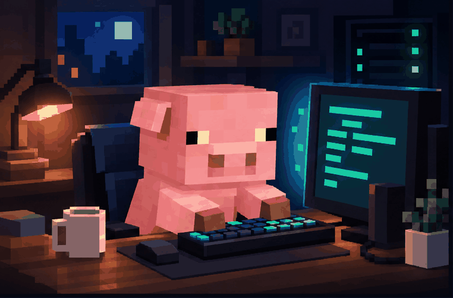

<div align="center">



# Hi, I'm Yifan Hou 👋

**AI Agent Builder · RAG Engineer · Full-stack Developer**

<p>
  <a href="https://github.com/HHHFFF-HHHFFF?tab=followers"></a>
  
</p>

`Building trustworthy AI agents, one trace at a time.`

</div>

## `$ whoami`

```text
📍 Master of Computing @ Australian National University
🧠 Building AI agents, RAG pipelines, evaluation and observability
🛡️ Interested in prompt-injection defense and reliable retrieval
⚙️ Working across Python/FastAPI and React/TypeScript
```

## Featured builds

<table>
  <tr>
    <td width="50%" valign="top">
      <h3>🔎 Deep Research Agent</h3>
      <p>Plan → retrieve → verify → synthesize, with local RAG, citation checks, execution traces and multi-model routing.</p>
      <p><code>Python</code> <code>FastAPI</code> <code>FAISS</code> <code>React</code></p>
      <a href="https://github.com/HHHFFF-HHHFFF/Deep_Research_Agent">Explore the repo →</a>
    </td>
    <td width="50%" valign="top">
      <h3>🧹 CleanPilot AI</h3>
      <p>An enterprise multi-agent service platform with hybrid retrieval, reranking, controlled skills, semantic memory and RBAC.</p>
      <p><code>LangGraph</code> <code>Chroma</code> <code>SSE</code> <code>TypeScript</code></p>
      <a href="https://github.com/HHHFFF-HHHFFF/CleanPilot-AI">Explore the repo →</a>
    </td>
  </tr>
  <tr>
    <td width="50%" valign="top">
      <h3>📋 Research Survey Platform</h3>
      <p>A four-arm, concealed-allocation online experiment platform built for research workflows.</p>
      <p><code>TypeScript</code> <code>Research tooling</code></p>
      <a href="https://github.com/HHHFFF-HHHFFF/Survey_Platform_for_Research">Explore the repo →</a>
    </td>
    <td width="50%" valign="top">
      <h3>🔌 Hardware side quests</h3>
      <p>ESP32 air-quality monitoring, power monitoring and a DIY split-flap display.</p>
      <p><code>ESP32</code> <code>IoT</code> <code>Prototyping</code></p>
      <a href="https://github.com/HHHFFF-HHHFFF?tab=repositories">Browse all projects →</a>
    </td>
  </tr>
</table>

## Toolbox

<p>
  
</p>

## GitHub signal

<div align="center">
  
  
</div>

---

<div align="center">
  <sub>🐷 The pig is compiling. Please do not unplug the carrots.</sub>
</div>
